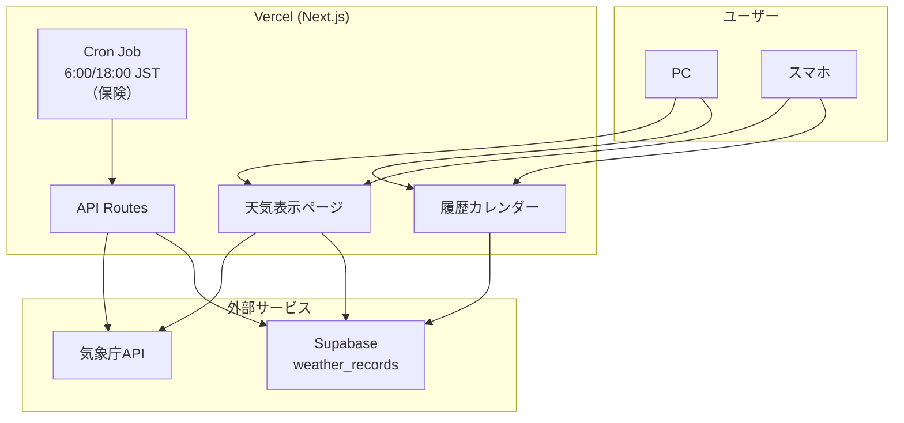

# 相模原天気予報サイト

相模原市の天気予報を表示するWebサイト。

## 技術スタック

- **フロントエンド**: Next.js 16 (App Router) + React 19
- **スタイリング**: Tailwind CSS v4
- **データベース**: Supabase (PostgreSQL)
- **ホスティング**: Vercel
- **天気データ**: 気象庁API
- **ソース管理**: GitHub

## 機能要件

### 天気表示
- 今日・明日の天気を表示
- 8日間の週間予報を表示
- 相模原市（神奈川県西部エリア）の天気を取得

### データ取得・保存
- **画面アクセス時**: 気象庁APIから取得し、DBを更新（1時間ごとにキャッシュ再検証）
- **Cron Job（保険）**: 1日2回（6:00 / 18:00 JST）実行、アクセスがない場合の保険
  - Vercel Free Tierの制限（2 Cron Jobs）に対応
- 1年間のデータを保持（Upsertで重複更新）
- 1年経過したデータは自動削除

### 履歴参照
- カレンダー形式で過去の天気を参照
- 月単位で表示
- 各日に天気アイコンを表示
- 統計情報（記録日数、晴れ/曇り/雨・雪の日数）を表示

### UI/UX
- PC・スマホ両対応（レスポンシブ）
- 和モダン（Wa-Modern）デザイン
- ガラスモーフィズムスタイルのカード
- 天気に連動した背景アニメーション
  - 晴れ: 青空、太陽が輝くアニメーション、光芒エフェクト
  - 曇り: 灰色、複数の雲が流れるアニメーション
  - 雨: 暗め、雨粒（60粒）が降るアニメーション
  - 雪: 薄いグレー、雪（40片）が降るアニメーション
- 山のシルエット（丹沢山系をイメージ）を背景に配置
- SEO・OGP対応（OpenGraph image、Twitter card）

## プロジェクト構成

```
src/
├── app/
│   ├── api/
│   │   ├── cron/route.ts          # Cron Jobエンドポイント
│   │   └── weather/route.ts       # 天気データAPI
│   ├── history/page.tsx           # 履歴ページ
│   ├── page.tsx                   # メインページ
│   ├── layout.tsx                 # レイアウト
│   ├── globals.css                # グローバルスタイル
│   ├── opengraph-image.tsx        # OGP画像生成
│   └── twitter-image.tsx          # Twitter card画像生成
├── components/
│   ├── WeatherBackground.tsx      # 天気別背景 + アニメーション
│   ├── WeatherCard.tsx            # 天気カード表示
│   ├── WeeklyForecast.tsx         # 週間予報表示
│   ├── Calendar.tsx               # カレンダーコンポーネント
│   └── HistoryContent.tsx         # 履歴ページコンテンツ
├── lib/
│   ├── jma.ts                     # 気象庁API連携
│   ├── supabase.ts                # Supabase クライアント
│   └── weather-db.ts              # DB更新共通処理
└── types/
    └── weather.ts                 # 型定義
```

## システム構成



## データベース設計

### weather_records テーブル

| カラム | 型 | 説明 |
|--------|-----|------|
| id | uuid | 主キー |
| date | date | 日付 |
| weather_code | text | 天気コード |
| weather_text | text | 天気テキスト（晴れ、曇りなど） |
| temp_high | integer | 最高気温（未使用） |
| temp_low | integer | 最低気温（未使用） |
| pop | integer | 降水確率(%) |
| fetched_at | timestamptz | 取得日時 |
| created_at | timestamptz | 作成日時 |

## 気象庁API

- エンドポイント: `https://www.jma.go.jp/bosai/forecast/data/forecast/140000.json`
- 地域コード:
  - `140000` - 神奈川県全体（週間予報の天気・降水確率）
  - `140020` - 神奈川県西部（今日〜明後日の天気・降水確率）
- 相模原市は「西部」エリアに該当

## 環境変数

### 必須（本番環境）
| 変数名 | 説明 |
|--------|------|
| `NEXT_PUBLIC_SUPABASE_URL` | Supabase プロジェクトURL |
| `NEXT_PUBLIC_SUPABASE_ANON_KEY` | Supabase 公開キー |
| `SUPABASE_SERVICE_ROLE_KEY` | Supabase サービスロールキー（Cron Job用） |
| `CRON_SECRET` | Vercel Cron Job認証シークレット |

### ローカル開発
`.env.local`に上記の環境変数を設定。`CRON_SECRET`と`SUPABASE_SERVICE_ROLE_KEY`はCron Jobのローカルテストに必要。

## 開発コマンド

```bash
npm run dev      # 開発サーバー起動
npm run build    # ビルド
npm run start    # 本番環境起動
npm run lint     # リント
```
