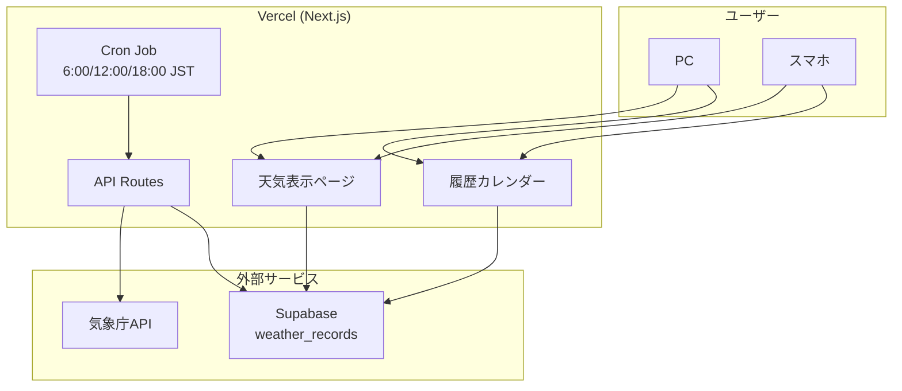

# 相模原天気予報サイト

相模原市の天気予報を表示するWebサイト。

## 技術スタック

- **フロントエンド**: Next.js (App Router)
- **データベース**: Supabase (PostgreSQL)
- **ホスティング**: Vercel
- **天気データ**: 気象庁API
- **ソース管理**: GitHub

## 機能要件

### 天気表示
- 今日・明日の天気を表示
- 一週間先までの週間予報を表示
- 相模原市（神奈川県西部エリア）の天気を取得

### データ取得・保存
- 1日3回（6:00 / 12:00 / 18:00 JST）気象庁APIからデータ取得
- Vercel Cron Jobsで定期実行
- 1年間のデータを保持
- 1年経過したデータは自動削除

### 履歴参照
- カレンダー形式で過去の天気を参照
- 月単位で表示
- 各日に天気アイコンを表示

### UI/UX
- PC・スマホ両対応（レスポンシブ）
- 天気に連動した背景
  - 晴れ: 青空、太陽が輝くアニメーション
  - 曇り: 灰色、雲が流れるアニメーション
  - 雨: 暗め、雨が降るアニメーション

## システム構成



## データベース設計

### weather_records テーブル

| カラム | 型 | 説明 |
|--------|-----|------|
| id | uuid | 主キー |
| date | date | 日付 |
| weather_code | text | 天気コード |
| weather_text | text | 天気テキスト（晴れ、曇りなど） |
| temp_high | integer | 最高気温 |
| temp_low | integer | 最低気温 |
| pop | integer | 降水確率(%) |
| fetched_at | timestamptz | 取得日時 |
| created_at | timestamptz | 作成日時 |

## 気象庁API

- エンドポイント: `https://www.jma.go.jp/bosai/forecast/data/forecast/140000.json`
- 地域コード: 140000（神奈川県）
- 相模原市は「西部」エリアに該当

## 開発コマンド

```bash
npm run dev      # 開発サーバー起動
npm run build    # ビルド
npm run lint     # リント
```
